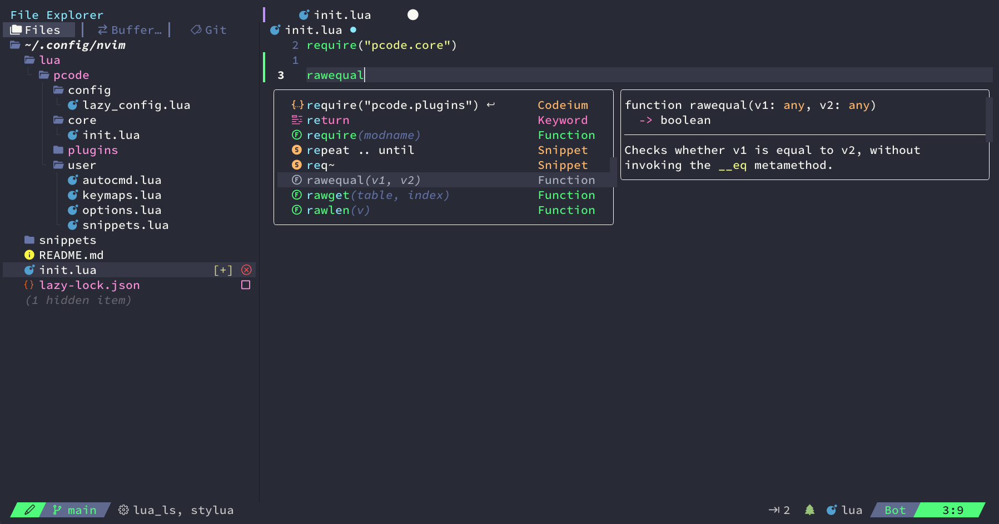

# neovim-config

## Preview



## Kebutuhan dasar

- [C++](https://www.msys2.org/)
- [Node JS](https://nodejs.org/en)
- [GIT](https://git-scm.com)
- [Ripgrep](https://github.com/BurntSushi/ripgrep)
- [Nerd Font](https://www.nerdfonts.com/)
- [Neovim v0.11](https://github.com/neovim/neovim/releases/tag/stable)

## Install

### Windows

```
git clone https://github.com/pojokcodeid/neovim-blink-cmp.git "$env:LOCALAPPDATA\nvim"
```

### Linux or MAC

```
git clone https://github.com/pojokcodeid/neovim-blink-cmp.git ~/.config/nvim
```

## Uninstall

```
# Linux / MacOS (unix)
rm -rf ~/.config/nvim
rm -rf ~/.local/state/nvim
rm -rf ~/.local/share/nvim

# Flatpak (linux)
rm -rf ~/.var/app/io.neovim.nvim/config/nvim
rm -rf ~/.var/app/io.neovim.nvim/data/nvim
rm -rf ~/.var/app/io.neovim.nvim/.local/state/nvim

# Windows CMD
rd -r ~\AppData\Local\nvim
rd -r ~\AppData\Local\nvim-data

# Windows PowerShell
rm -Force ~\AppData\Local\nvim
rm -Force ~\AppData\Local\nvim-data
```

## Plugins

- [&#x2713;] lazy.nvim
- [&#x2713;] plenary.nvim
- [&#x2713;] nvim-treesitter
- [&#x2713;] Mason-lspconfig.nvim
- [&#x2713;] mason.nvim
- [&#x2713;] nvim-lspconfig
- [&#x2713;] blink.cmp
- [&#x2713;] blink-ripgrep.nvim
- [&#x2713;] colorful-menu.nvim
- [&#x2713;] nvim-autopairs
- [&#x2713;] nvim-ts-autotag
- [&#x2713;] alpha-nvim
- [&#x2713;] friendly-snippets
- [&#x2713;] LuaSnip
- [&#x2713;] Bufferline.nvim
- [&#x2713;] Noice.nvim
- [&#x2713;] Comment.nvim
- [&#x2713;] conform.nvim
- [&#x2713;] dracula.nvim
- [&#x2713;] dressing.nvim
- [&#x2713;] gitsign.nvim
- [&#x2713;] hlchunk.nvim
- [&#x2713;] lualine.nvim
- [&#x2713;] nvim-navic
- [&#x2713;] neo-tree.nvim
- [&#x2713;] nvim-notify
- [&#x2713;] nvim-lint
- [&#x2713;] telescope.nvim
- [&#x2713;] toggleterm.nvim
- [&#x2713;] nvim-web-devicons
- [&#x2713;] which-key.nvim

## PCode Command

```
:PCodeAdd <Lang or Plugin or Config>            # for activate lang, plugin or config
:PCodeRemove <Lang or Plugin or Config>         # for inactive lang, plugin or config

:PCodeConfig                                    # for show all table config
:Theme <theme name>                             # for change theme
```

## Key Maps

<table>
  <tr>
    <td>:q or :quit</td>
    <td>exit the form</td>
  </tr>
  <tr>
    <td>:w or :write</td>
    <td>write the typing result into a file (save)</td>
  </tr>
  <tr>
    <td>:wq</td>
    <td>save and exit</td>
  </tr>
  <tr>
    <td>:q!</td>
    <td>Exit and do not save</td>
  </tr>
  <tr>
    <td>escape</td>
    <td>normal mode</td>
  </tr>
  <tr>
    <td>i</td>
    <td>insert mode</td>
  </tr>
  <tr>
    <td>v</td>
    <td>visual mode, must be in normal mode first</td>
  </tr>
  <tr>
    <td>h</td>
    <td>left</td>
  </tr>
  <tr>
    <td>j</td>
    <td>down</td>
  </tr>
  <tr>
    <td>k</td>
    <td>up</td>
  </tr>
  <tr>
    <td>l</td>
    <td>right</td>
  </tr>
  <tr>
    <td>:ter</td>
    <td>open the terminal</td>
  </tr>
  <tr>
    <td>0 or home</td>
    <td>move the cursor to the beginning of the line</td>
  </tr>
  <tr>
    <td>$ or end</td>
    <td>move the cursor to the end of the line</td>
  </tr>
  <tr>
    <td>gg</td>
    <td>move the cursor to the top</td>
  </tr>
  <tr>
    <td>G</td>
    <td>move the cursor to the end of the page</td>
  </tr>
  <tr>
    <td>w</td>
    <td>move the cursor to the next word with out spaces</td>
  </tr>
  <tr>
    <td>3w</td>
    <td>move the cursor to the next 3 words</td>
  </tr>
  <tr>
    <td>b</td>
    <td>move the cursor to the previous word</td>
  </tr>
  <tr>
    <td>3b</td>
    <td>move the cursor to the previous 3 words</td>
  </tr>
  <tr>
    <td>(</td>
    <td>move the cursor to the previous paragraph</td>
  </tr>
  <tr>
    <td>)</td>
    <td>move the cursor to the next paragraph</td>
  </tr>
  <tr>
    <td>dd</td>
    <td>delete text 1 line</td>
  </tr>
  <tr>
    <td>d$</td>
    <td>delete words until the end of the line from the cursor position</td>
  </tr>
  <tr>
    <td>d0</td>
    <td>
      delete words until the beginning of the line from the cursor position
    </td>
  </tr>
  <tr>
    <td>U</td>
    <td>to undo</td>
  </tr>
  <tr>
    <td>CTRL + r</td>
    <td>Rendo</td>
  </tr>
  <tr>
    <td>Yp</td>
    <td>duplicate line code</td>
  </tr>
  <tr>
    <td>yyp</td>
    <td>same duplicate line code</td>
  </tr>
  <tr>
    <td>:m+1</td>
    <td>move 1 line down</td>
  </tr>
  <tr>
    <td>:m-1</td>
    <td>move 1 line up</td>
  </tr>
  <tr>
    <td>d</td>
    <td>delete code that is selected with view mode</td>
  </tr>
  <tr>
    <td>:e newfolder/newfile.ext</td>
    <td>create a new file in a new folder</td>
  </tr>
  <tr>
    <td>:f newfolder/newfile.ext</td>
    <td>to copy the file from the open file</td>
  </tr>
  <tr>
    <td>bdw</td>
    <td>delete 1 word</td>
  </tr>
  <tr>
    <td>dw</td>
    <td>delete to the right in 1 word at the cursor position</td>
  </tr>
</table>
